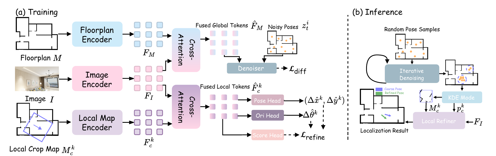

# CF2Loc

Official implementation of CF2Loc, a coarse-to-fine visual floorplan
localization framework. CF2Loc first samples globally plausible camera poses
with a full-map diffusion model, then applies a dense local refiner to the
KDE-selected coarse pose.

<div align="center">
  
</div>

## Installation

Python 3.8 or newer is recommended.

```bash
python -m venv .venv
source .venv/bin/activate
pip install -r requirements.txt
```

Download the Depth Anything V2 ViT-S checkpoint to:

```text
checkpoints/depth_anything_v2_vits.pth
```

The checkpoint is available from the
[Depth Anything V2 repository](https://huggingface.co/depth-anything/Depth-Anything-V2-Small/resolve/main/depth_anything_v2_vits.pth).

## Configurations

| Dataset | Floorplan representation | Stage 1 | Stage 2 |
| --- | --- | --- | --- |
| Structured3D | grayscale | `PoseQueryDiffusion_S3D.yaml` | `PoseLocalRefiner_S3D_Dense.yaml` |
| Structured3D | semantic one-hot | `PoseQueryDiffusion_SemRayLoc_SemanticOneHot.yaml` | `PoseLocalRefiner_SemRayLoc_SemanticOneHot_Dense.yaml` |
| ZInD | grayscale | `PoseQueryDiffusion_ZInD_MainDiffusion.yaml` | `PoseLocalRefiner_ZInD_MainDiffusion.yaml` |
| ZInD | semantic one-hot | `PoseQueryDiffusion_ZInD_SemanticOneHot.yaml` | `PoseLocalRefiner_ZInD_SemanticOneHot_Dense.yaml` |

Non-semantic models use a single grayscale floorplan channel. Semantic models
use hard one-hot floorplan labels. The default local refiner uses an oriented
`5 m x 5 m` grayscale crop without additional edge channels.

## Training

Train the full-map diffusion model:

```bash
python training/train_pose_query_diffusion.py \
  --config PoseQueryDiffusion_S3D.yaml
```

Train the local refiner with a frozen Stage-1 checkpoint:

```bash
python training/train_pose_local_refiner.py \
  --config PoseLocalRefiner_S3D_Dense.yaml \
  --baseline_checkpoint_path /path/to/stage1.ckpt
```

Use the corresponding configuration from the table to switch datasets or
floorplan representations. Non-semantic Stage-1 models and local refiners train
for 30 epochs. Semantic Stage-1 models train for 60 epochs.

## Evaluation

Run the complete Structured3D test split:

```bash
python eval/eval_pose_local_refiner.py \
  --config PoseLocalRefiner_S3D_Dense.yaml \
  --diffusion_ckpt checkpoints/release_s3d/s3d_no_sem_stage1_best.ckpt \
  --refiner_ckpt checkpoints/release_s3d/s3d_no_sem_dense_refiner_best.ckpt \
  --split test \
  --seed 0 \
  --val_particles 64 \
  --sample_steps 20 \
  --top_k 1 \
  --pose_selection kde \
  --cache_refiner_image
```

Stage-1 sampling caches map-attention projections across denoising steps.
Evaluation refines the KDE-selected pose by default. Pass `--top_k 8` only for
the candidate-quality reranking ablation.

## Checkpoints

Checkpoint binaries are not stored in Git. Expected filenames and SHA-256
hashes are documented in:

- `checkpoints/release_s3d/manifest.json`
- `checkpoints/release_zind/manifest.json`

After placing the files at the paths listed in `checkpoints/README.md`, verify
that every model loads strictly with its release configuration:

```bash
python scripts/check_release_checkpoints.py
```

## Tests

```bash
PYTEST_DISABLE_PLUGIN_AUTOLOAD=1 python -m pytest -q tests
```

## License

This project is released under the MIT License.
