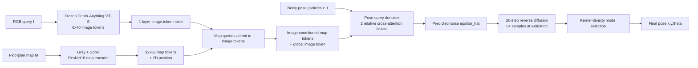

# Pose-Query Diffusion for Floorplan Localization

## 1. 文档范围

本文档描述当前 `e781938` Pose-Query Diffusion localizer 及其 ZInD 适配版本的**实际实现**，可作为论文方法部分的技术底稿。该版本以单张透视 RGB 图像和整层平面图为输入，直接预测二维位置和朝向的多模态后验分布。

当前版本不包含 RRP candidate matching、显式几何 likelihood、depth expert、Gibson 微调或任何后续容量消融。虽然数据文件中保留了 `depth40.txt`，该 baseline 的训练损失目前不使用它。

## 2. 问题定义

给定：

- 查询透视图像 \(I\in\mathbb{R}^{3\times H\times W}\)；
- 同一楼层的全局平面图 \(M\)；
- 平面图的像素尺寸 \((W_M,H_M)\) 和地图分辨率 \(r\) 米/像素；

目标是预测相机位姿 \(p=(x,y,\theta)\)，其中 \((x,y)\) 是 map-pixel 坐标，\(\theta\in[0,2\pi)\) 是地图坐标系下的相机朝向。模型学习条件分布：

\[
p(p\mid I,M).
\]

输出不是单一回归位姿，而是从该分布采样多个候选，再通过密度 mode 选择最终预测。这使模型可显式表达室内视觉定位的房间级与走廊级歧义。

## 3. 数据与统一场景格式

### 3.1 统一格式

每个楼层 scene 包含：

```text
scene_xxx_floor_yy/
  map.png             # 灰度 wall map
  rgb/*.jpg           # 查询透视图像
  poses_map.txt       # x y theta，map-pixel 坐标
  depth40.txt         # 可选的 40 条水平射线深度，单位米
  metadata.json
```

训练 dataloader 将地图缩放到 \(256\times256\) 作为网络输入，但将原图尺寸 \((W_M,H_M)\) 一并传入，用于把归一化位姿重新解码到真实 map-pixel 坐标。

### 3.2 S3D 与 ZInD 规模

下表为实际可读样本数，而不是压缩包中的文件数。

| 数据集 | Train scenes / samples | Val scenes / samples | Test scenes / samples |
| --- | ---: | ---: | ---: |
| Structured3D | 2,990 / 65,048 | 250 / 6,726 | 250 / 6,405 |
| ZInD | 1,957 / 192,000 | 244 / 22,656 | 252 / 22,764 |

ZInD scene 数较少，但每个 floor scene 有更多 panorama；每个 panorama 被渲染为四个固定 yaw 的 \(80^\circ\) 透视视图。因此，ZInD 每个 epoch 有 24,000 个 batch step，而历史 S3D 设置每个 epoch 为 8,131 step。比较学习曲线时应按优化步数而非 epoch 数对齐。

### 3.3 ZInD 适配

ZInD 转换脚本为 [`scripts/prepare_zind.py`](../scripts/prepare_zind.py)。转换直接复用 SemRayLoc 提供的：

- `processed/<scene>/floorplan_walls_only.png` 作为 \(1\) cm/pixel 的 wall map；
- `processed/<scene>/poses.txt` 作为 meter pose；
- `processed/<scene>/metadata.json` 作为 pano 相对路径；
- `processed/split.yaml` 作为 home-disjoint 的 train/val/test split。

转换时将位置乘以 100 得到 map-pixel 坐标；从原始 equirectangular panorama 渲染 yaw 为 \(0,90,180,270^\circ\) 的 \(360\times640\) 透视图。每个视角的朝向更新为：

\[
\theta_{view}=(\theta_{pano}-\mathrm{yaw})\bmod 2\pi.
\]

脚本还从 wall map raycast 40 条水平射线，最大距离 15 m，写入 `depth40.txt`。此项是后续几何监督的可用标签，不属于当前 baseline 的优化目标。

## 4. 模型概览



模型宽度 \(d=128\)，注意力头数为 4，dropout 为 0.1。图像 backbone 冻结，其余模块从头训练。

## 5. 条件编码器

### 5.1 图像分支

查询图像使用预训练 Depth-Anything V2 的 DINOv2 ViT-S backbone。实现取第 11 个 intermediate layer 的 384 维 patch feature；backbone 始终冻结。输入先补齐到 patch size 14 的整数倍，随后：

1. 将 patch grid 双线性插值为 \(6\times40\)；
2. 用 \(1\times1\) 卷积投影到 128 维；
3. 加入由二维位置经 MLP 产生的位置编码；
4. 使用一层 pre-norm Transformer encoder mixer 建模 image token 间上下文。

最终得到 \(N_I=240\) 个 image token \(T_I\in\mathbb{R}^{240\times128}\)，并以 token 均值作为全局图像描述 \(g_I\)。

### 5.2 平面图分支

输入地图先转为灰度，再拼接 Sobel \(x/y\) 边缘，形成三通道输入。使用未预训练的 ResNet-18 前半部分：`conv1 -> maxpool -> layer1 -> layer2`，对 \(256\times256\) 输入输出 \(32\times32\) 的 64 维 feature map。经 \(1\times1\) 投影后，得到 \(N_M=1024\) 个 128 维 map token。

每个 token 具有归一化二维坐标 \(c_j\in[-1,1]^2\)，通过 MLP 编码后加到 token 上。随后以 map token 为 query、image token 为 key/value 做一次 4-head cross-attention，并接一个残差 FFN：

\[
T_M\leftarrow\mathrm{FFN}(\mathrm{LN}(T_M+\mathrm{Attn}(T_M,T_I,T_I))).
\]

因此每个地图位置都获得了与当前查询图像相关的条件特征，而不是独立编码地图和图像后再做全局拼接。

## 6. 位姿表示与扩散模型

### 6.1 连续位姿状态

为避免角度 \(0\) 与 \(2\pi\) 的不连续性，位姿被编码为四维连续状态：

\[
z_0=\left[2x/W_M-1,\;2y/H_M-1,\;\sin\theta,\;\cos\theta\right].
\]

位置限制在 \([-1,1]\)，角度二元向量在每次 clean-pose 估计后归一化。解码时用 `atan2(sin, cos)` 恢复 \(\theta\)。

### 6.2 前向扩散

采用 1,000 step cosine beta schedule。对每个 GT pose 复制 8 份，独立采样时间步 \(t\) 与高斯噪声 \(\epsilon\)：

\[
z_t=\sqrt{\bar\alpha_t}z_0+\sqrt{1-\bar\alpha_t}\epsilon.
\]

这里的 8 个 particle 不是可学习 query embedding，而是同一条件下不同随机噪声状态，用于训练条件 denoiser 覆盖多模态后验。

### 6.3 Pose-query denoiser

对每个 noisy pose \(z_t\)：

1. 使用四个 Fourier band 编码 4 维位姿状态；
2. 通过 MLP 投影为 128 维 pose token；
3. 加入 sinusoidal timestep embedding 与投影后的全局图像 token \(g_I\)；
4. 通过两层 pose-to-map cross-attention block；
5. 输出 4 维噪声估计 \(\hat\epsilon\)。

pose-to-map attention 不是普通全局 attention。对于 pose \(u_i\)、朝向 \(\theta_i\) 和 map coordinate \(c_j\)，先计算相对位置并旋转到相机局部坐标：

\[
\Delta=c_j-u_i,\quad
q_x=\cos\theta_i\Delta_x+\sin\theta_i\Delta_y,\quad
q_y=-\sin\theta_i\Delta_x+\cos\theta_i\Delta_y.
\]

\([q_x,q_y,\|\Delta\|,\|\Delta\|^2]\) 经 MLP 产生每个 attention head 的 additive bias。该设计让每个候选 pose 可根据自身位置和朝向，从条件 map token 中检索相对几何证据。

## 7. 训练目标

网络以 noise prediction 为主目标：

\[
\mathcal{L}_{noise}=
\mathrm{MSE}(\hat\epsilon_{xy},\epsilon_{xy})+
\lambda_\theta\mathrm{MSE}(\hat\epsilon_{ang},\epsilon_{ang}).
\]

此外，从 \(z_t\) 与 \(\hat\epsilon\) 重建 clean pose \(\hat z_0\)，使用位置 Smooth-L1 和角度 cosine loss：

\[
\mathcal{L}_{clean}=
\mathrm{SmoothL1}(\hat z_{0,xy},z_{0,xy})+
\lambda_\theta(1-\langle\hat z_{0,ang},z_{0,ang}\rangle).
\]

总损失为：

\[
\mathcal{L}=\mathcal{L}_{noise}+0.1\mathcal{L}_{clean},
\]

其中 \(\lambda_\theta=1\)。

## 8. 推理与 mode 选择

推理从 64 个独立高斯噪声状态开始，采用 20 个均匀选取的时间步进行确定性 DDIM-style reverse update，得到候选集合 \(\{p_k\}_{k=1}^{64}\)。

最终位姿由 kernel-density mode 选择，而不是粒子均值。对每个候选 \(p_i\) 计算：

\[
s_i=\sum_j\exp\left[-\frac{1}{2}\left(
\frac{\|x_i-x_j\|^2r^2}{\sigma_m^2}+
\frac{\Delta\theta_{ij}^2}{\sigma_\theta^2}
\right)\right].
\]

选择 \(s_i\) 最大的粒子作为最终 pose。当前 \(\sigma_m=0.75\) m，\(\sigma_\theta=20^\circ\)。同时保留 best-of-8/32/64 指标，以区分“候选集合是否覆盖 GT”与“mode selector 是否选对 cluster”。

## 9. 训练配置

| 项目 | 当前值 |
| --- | ---: |
| 图像 backbone | Depth-Anything V2 ViT-S，冻结 |
| 图像 token grid | \(6\times40\) |
| map token grid | \(32\times32\) |
| 隐藏维度 / attention heads | 128 / 4 |
| image mixer / denoiser blocks | 1 / 2 |
| diffusion train steps / sample steps | 1000 / 20 |
| train particles / validation particles | 8 / 64 |
| batch size / validation batch size | 8 / 4 |
| optimizer | AdamW，weight decay \(10^{-4}\) |
| learning rate | \(10^{-4}\rightarrow10^{-5}\) cosine decay |
| nominal training epochs | 30 |
| ZInD map resolution | 0.01 m/pixel |

checkpoint 按 `val_1m_recall` 保存，mode 为 `max`。

## 10. 评价指标

令 \(\hat p\) 是 mode-selected pose，\(p^*\) 是 GT pose：

- `1m_recall`：\(\|\hat x-x^*\|r\le1\) m 的比例；
- `0.5m_recall`：同理，阈值为 0.5 m；
- `1m_30deg_recall`：位置在 1 m 内且角度误差不超过 \(30^\circ\)；
- `mean_xy_err_m` 与 `mean_theta_err_deg`；
- `best_of_K_1m_recall`：\(K\) 个 sampled particle 中任一粒子落在 1 m 内的比例。

论文主结果应报告 mode-selected 指标；best-of-K 应作为 oracle-like proposal coverage 诊断，不应与单预测方法直接比较。

## 11. 当前 ZInD 实验状态

当前训练 run 为 `pose_query_diffusion_zind_s3d_base`。截至 2026-06-25，已完成 epoch 4 的内部验证结果为：

| Epoch | val 1m recall | val best-of-64 1m recall |
| ---: | ---: | ---: |
| 0 | 0.088 | 0.842 |
| 1 | 0.135 | 0.873 |
| 2 | 0.204 | 0.897 |
| 3 | 0.261 | 0.903 |
| 4 | 0.325 | 0.910 |

这些数值是训练中的 validation 记录，不能在训练结束和 test-set evaluation 前作为最终论文主表结论。当前 hotmap 显示，部分 ZInD 样本已形成正确 cluster，但仍存在候选广泛分散、错误 cluster 更密的情况。

## 12. 已知限制与论文表述边界

1. 当前 baseline 不使用 `depth40.txt`，因此不能表述为显式 depth/ray-guided localization。
2. ZInD 训练视角为四个固定 yaw，尚未实现 SemRayLoc 风格的 online continuous random-yaw augmentation。
3. validation sampling 尚未固定随机 generator；跨 epoch 的数值虽在大验证集上较稳定，严格消融时仍应固定采样种子。
4. 当前 map 输入仅为 wall structure 和 Sobel edge，不使用房间语义、门窗语义或文本标签。
5. 模型生成完整 pose distribution；高 best-of-64 而低 mode recall 表明候选覆盖不等同于最终定位正确，需要分别分析 denoiser 条件性与 mode-selection 策略。

## 13. 复现命令

```bash
cd /home/ros/meng/DisCo-FLoc-s3d-zind

# ZInD conversion (already completed on the current machine)
.venv/bin/python scripts/prepare_zind.py \
  --raw-root /home/ros/data/zind/raw_data \
  --semrayloc-processed-root /home/ros/data/zind/processed \
  --output-root /home/ros/data/zind/disco_floc \
  --skip-existing

# S3D-base architecture trained on ZInD
.venv/bin/python training/train_pose_query_diffusion.py \
  --config PoseQueryDiffusion_ZInD_S3DBase.yaml
```
